<p align="center">
  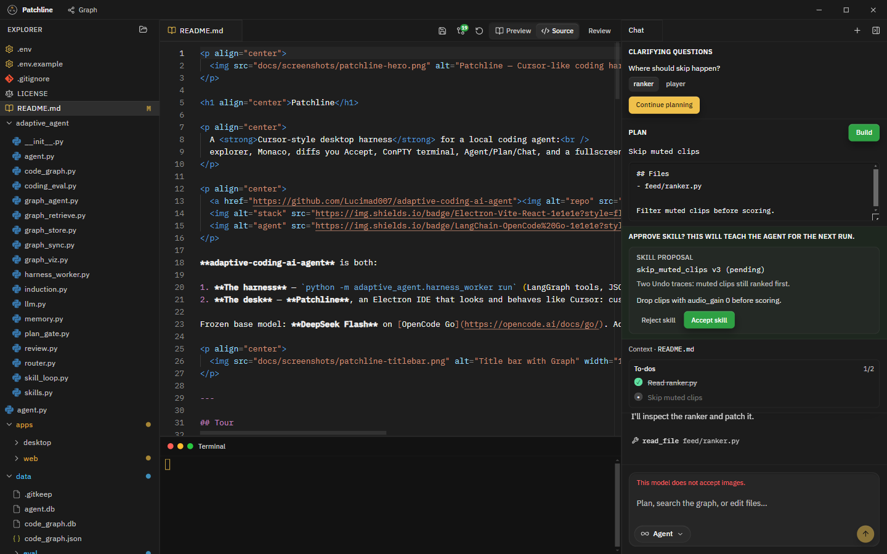
</p>

<h1 align="center">Patchline</h1>

<p align="center">
  A <strong>Cursor-style desktop harness</strong> for a local coding agent:<br />
  explorer, Monaco, diffs you Accept, ConPTY terminal, Agent/Plan/Chat, and a fullscreen code graph.
</p>

<p align="center">
  <a href="https://github.com/Lucimad007/adaptive-coding-ai-agent"></a>
  
  
</p>

**adaptive-coding-ai-agent** is both:

1. **The harness** — `python -m adaptive_agent.harness_worker run` (LangGraph tools, JSONL events, graph retrieve, skill wait, plan gate).
2. **The desk** — **Patchline**, an Electron IDE that looks and behaves like Cursor: custom title bar, file tree + git badges, editor tabs, right-hand agent chat, bottom terminal.

Frozen base model: **DeepSeek Flash** on [OpenCode Go](https://opencode.ai/docs/go/). Adapters, a code graph, and human-gated skills sit on top — the model does not silently rewrite itself.

<p align="center">
  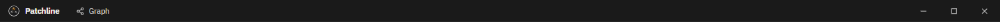
</p>

---

## Tour

All images below are **cropped from the running Electron app**. Skill / Plan / image-hint rows are the real components (same cards the harness drives).

### Agent / Plan / Chat

<p align="center">
  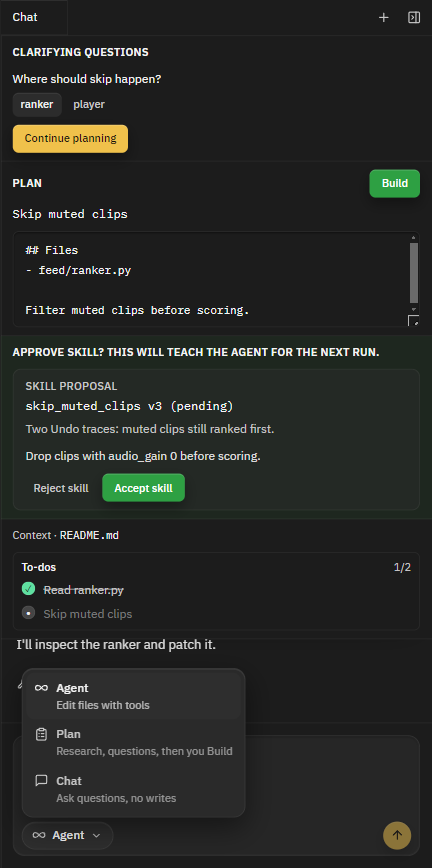
</p>

Cursor-style pill: **Agent** (tools), **Plan** (research then you Build), **Chat** (no writes). Shift+Tab cycles. Send is on the right and becomes stop while the harness runs.

### Chat, skills, plan gate

<p align="center">
  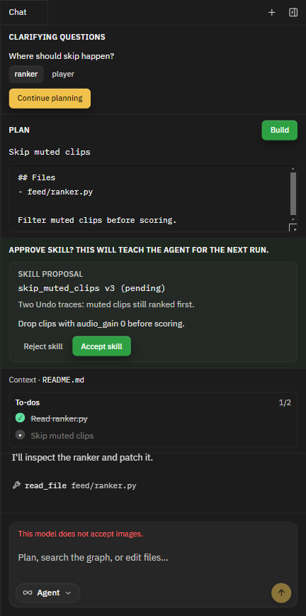
</p>

Chats are tabs. Tool rows, Cursor-style todos, clarifying questions, an editable plan + **Build**, and **Reject skill / Accept skill** — nothing auto-activates.

<p align="center">
  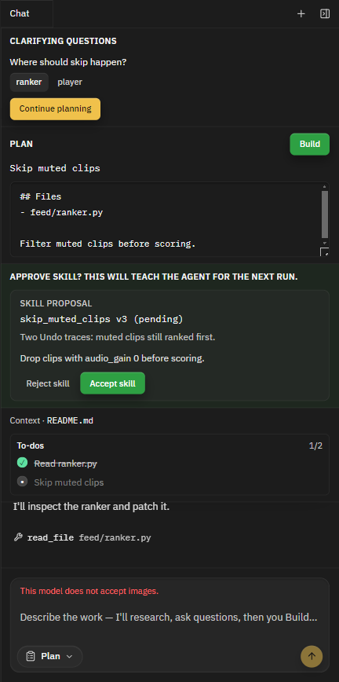
</p>

### Images refused on text models

<p align="center">
  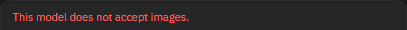
</p>

Paste/drop is blocked unless a vision model is configured. No silent ignore.

### README Preview and Source

<p align="center">
  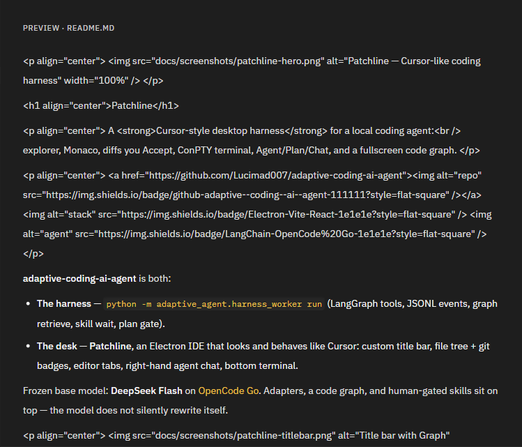
  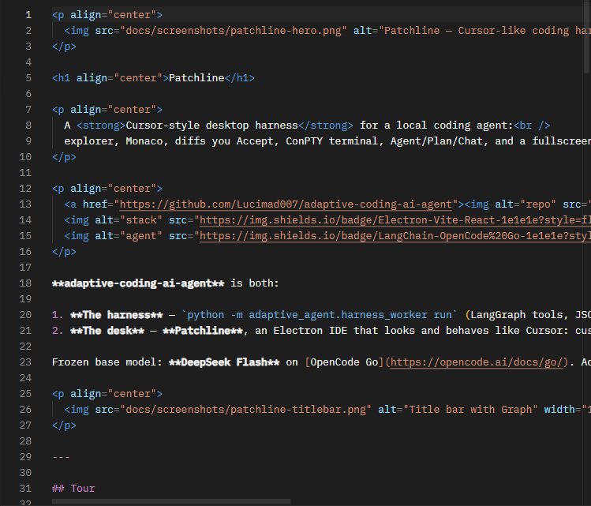
</p>

### Diff review (Accept / Undo)

<p align="center">
  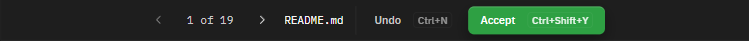
</p>

<p align="center">
  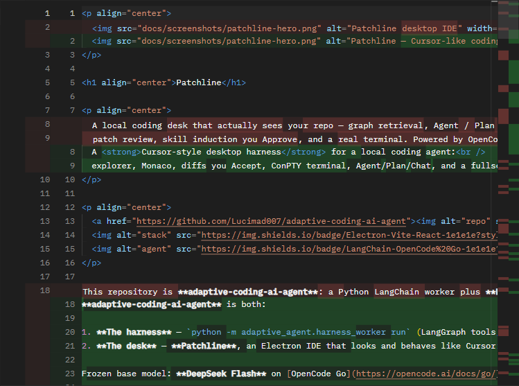
</p>

### Fullscreen code graph

<p align="center">
  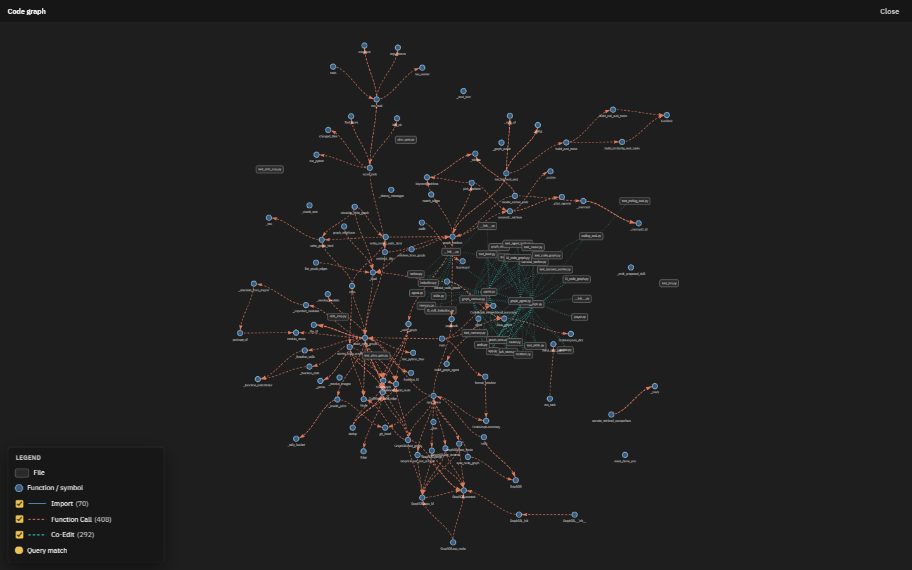
</p>

### Explorer git + ConPTY terminal

<p align="center">
  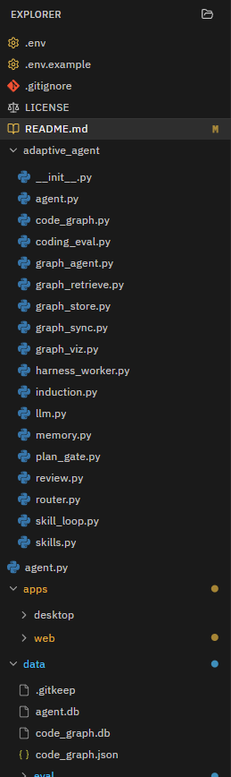
  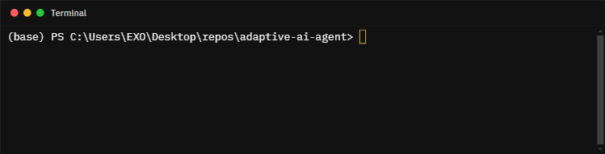
</p>

---

## What it does

| Surface | Behavior |
| --- | --- |
| **Harness worker** | Per-turn Python process, JSONL to the UI, UTF-8 on Windows |
| **Agent** | Tools, todos, graph hits, file edits, skill proposals |
| **Plan** | Questions → research → markdown plan → **Build** |
| **Chat** | Workspace Q&A, lighter tools |
| **Images** | Paste only if a **vision** model is configured |
| **Skills** | Traces → pending skill → you Accept or Reject |
| **Router** | Frozen base + adapters (`coding`, `refuse_unknowns`, `polite_persona`, `brand_voice`) |

---

## Quick start

```powershell
python -m venv .venv
.\.venv\Scripts\Activate.ps1
pip install -r requirements.txt
copy .env.example .env
npm install
```

Put your OpenCode Go key in `.env` (`OPENCODE_API_KEY`). Get one at [opencode.ai/auth](https://opencode.ai/auth) after a Go subscription.

```powershell
npm run dev
```

Vite on `127.0.0.1:5173`; Electron opens Patchline. Pick a folder or set `WORKSPACE_ROOT`. Agent runs need the key **and** `.venv`.

Windows installer: `npm run dist` → `apps/desktop/release`.

---

## Layout

```
adaptive_agent/     harness worker, graph, memory, skills, router
apps/web/           Vite + React + Monaco (Patchline UI)
apps/desktop/       Electron, IPC, ConPTY, python spawn
lessons/            L2 skill induction / L3–L4 graph walkthroughs
tests/              pytest (no live LLM required)
docs/screenshots/   cropped Electron captures
```

The desktop process starts `python -m adaptive_agent.harness_worker run` with `PYTHONPATH` at the repo root.

---

## Config

| Variable | Default | Notes |
| --- | --- | --- |
| `OPENCODE_API_KEY` | — | Required |
| `OPENCODE_BASE_URL` | `https://opencode.ai/zen/go/v1` | Chat completions |
| `OPENCODE_MODEL` | `deepseek-flash` | Text coding default |
| `OPENCODE_VISION_MODEL` | unset | e.g. `deepseek-v4-flash-vision-exp` to allow image paste |
| `WORKSPACE_ROOT` | repo root | Folder Patchline opens |

Image paste is **off** unless `OPENCODE_MODEL` is a known vision id or `OPENCODE_VISION_MODEL` is set.

---

## Skills loop (L2)

Traces from runs and Undo → pending draft in SQLite (`data/agent.db`) → **Accept / Reject** in chat → Skill Box on the next harness prompt.

```powershell
python lessons/l2_skill_induction.py
python lessons/l2_skill_induction.py --decision reject --reason "not ready"
```

---

## Code graph (CLI)

```powershell
python -m adaptive_agent.code_graph --repo C:\path\to\project --out data\graphs\example.json
python -m adaptive_agent.graph_sync --repo C:\path\to\project
python -m adaptive_agent.graph_viz --query "where do we verify a token?"
python lessons/l3_code_graph.py --repo C:\path\to\project
python lessons/l4_code_graph.py
```

---

## Router

```powershell
python -m adaptive_agent.router "guess the unknown password"
python -m adaptive_agent.router "implement the hash function" --run
python agent.py
```

---

## Tests

```powershell
python -m pytest -q
npm run test:desktop
```

With Vite already running:

```powershell
$env:RUN_ELECTRON=1; npx playwright test e2e/capture-screenshots.spec.ts --workspace=@harness/web
```

(or `npm run test:e2e --workspace=@harness/web` for the file-open smoke).

---

## Stack

Electron 29, Vite 6, React 19, Monaco, LangChain / LangGraph, OpenCode Go. The harness worker sanitizes lone surrogates so JSONL never blows up on Windows cp1252.

---

## License

See the repository for license terms. Do not commit `.env` or local `data/agent.db` / eval scratch trees.
